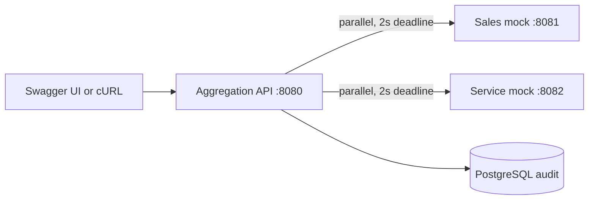

# Keyloop Unified Document Viewer

Backend service-layer implementation for **Scenario D: The Unified Document Viewer** from the Keyloop Technical Assessment.

## Current status

The Scenario D backend is functionally complete. It concurrently aggregates both mocked systems, returns deterministic complete or partial responses, persists privacy-safe audit outcomes in PostgreSQL, exposes correlation-aware telemetry and Swagger UI, and is covered by unit, HTTP-contract, and PostgreSQL integration tests.

See:

- [Requirements and traceability](docs/REQUIREMENTS.md)
- [System design](docs/SYSTEM_DESIGN.md)
- [Architecture decisions](docs/DECISIONS.md)
- [AI collaboration narrative](docs/AI_COLLABORATION.md)

## Problem

A dealership user needs one search interface for all documents related to a vehicle. The backend accepts a VIN, queries mocked Sales and Service systems in parallel, normalizes the results, and returns a consolidated list that identifies the source of every document.

## Service behavior

- Validate the supplied VIN.
- Query both mocked downstream systems concurrently.
- Normalize incompatible downstream response formats.
- Return deterministic, source-attributed results.
- Return useful partial results if exactly one dependency fails or times out.
- Persist a minimal search audit record.
- Emit structured, correlation-aware telemetry.

## Repository structure

```text
.
|-- README.md
|-- aggregator-service
|-- mock-sales-system
|-- mock-service-system
|-- compose.yml
`-- docs
    |-- api
    |-- AI_COLLABORATION.md
    |-- DECISIONS.md
    |-- REQUIREMENTS.md
    `-- SYSTEM_DESIGN.md
```

The aggregator keeps source-specific HTTP models inside separate adapters. The application service only sees normalized document metadata and source outcomes.



## Selected technology baseline

- Kotlin 2.4.0
- Spring Boot 4.1.0
- Java 25 LTS
- Gradle 9.5.0 via the Gradle Wrapper
- PostgreSQL 18.4
- springdoc-openapi 3.0.3 for OpenAPI and Swagger UI

Spring Boot dependency management controls compatible transitive library versions. The project uses stable releases, not milestones, release candidates, snapshots, or experimental APIs.

## Client-side scope

Scenario D describes a search UI and aggregated view, but the assessment explicitly allows backend candidates to mock or stub the client through cURL or OpenAPI. This repository provides Swagger UI and cURL examples instead of implementing a custom frontend. See [requirements and traceability](docs/REQUIREMENTS.md).

## Build, run, and test

Prerequisites:

- JDK 17 or newer to launch Gradle; Java 25 is automatically provisioned as the build toolchain.
- Podman Compose or Docker Compose for PostgreSQL and the Testcontainers integration test.

Use `docker compose` in place of `podman compose` in the commands below when Docker is your local container runtime.

Run the full build check:

```bash
./gradlew test ktlintCheck
```

This executes 15 tests covering VIN validation, parallel orchestration, complete/partial/failed outcomes, deterministic deduplication, audit failure, both downstream contracts, correlation IDs, HMAC privacy, and a real PostgreSQL 18.4 migration/write/read cycle.

Format Kotlin and Gradle Kotlin DSL files:

```bash
./gradlew ktlintFormat
```

Start PostgreSQL:

```bash
podman compose up -d postgres
```

Then start each service in a separate terminal:

```bash
./gradlew :mock-sales-system:bootRun
./gradlew :mock-service-system:bootRun
./gradlew :aggregator-service:bootRun
```

Local endpoints:

| Component | URL |
|---|---|
| Aggregator health | `http://localhost:8080/actuator/health` |
| Swagger UI | `http://localhost:8080/swagger-ui.html` |
| Sales mock health | `http://localhost:8081/actuator/health` |
| Service mock health | `http://localhost:8082/actuator/health` |
| Prometheus metrics | `http://localhost:8080/actuator/prometheus` |

The versioned static contracts are also available at [public API](docs/api/openapi.yaml), [Sales mock](docs/api/sales-system.openapi.yaml), and [Service mock](docs/api/service-system.openapi.yaml).

## Try the API

The mock fixtures use the final VIN character to make every important path reproducible:

| VIN | Expected behavior |
|---|---|
| `WVWZZZ1JZXW000001` | `200 COMPLETE`, two Sales and two Service documents |
| `WVWZZZ1JZXW000002` | `200 PARTIAL`, Sales unavailable |
| `WVWZZZ1JZXW000003` | `200 PARTIAL`, Service exceeds the independent two-second timeout |
| `WVWZZZ1JZXW000004` | `200 COMPLETE`, both sources valid but empty |
| `WVWZZZ1JZXW000005` | `503`, both sources unavailable |
| `WVWZZZ1JZXW000006` | `200 PARTIAL`, Sales returns a mismatched VIN and is classified as invalid |

Complete result:

```bash
curl -i http://localhost:8080/api/v1/vehicles/WVWZZZ1JZXW000001/documents
```

Timeout with useful partial data:

```bash
curl -i http://localhost:8080/api/v1/vehicles/WVWZZZ1JZXW000003/documents
```

Caller correlation IDs are propagated when they are valid UUIDs; absent or invalid values are replaced:

```bash
curl -i \
  -H 'X-Correlation-ID: 28ac4434-cbef-46df-8876-28b73c52f864' \
  http://localhost:8080/api/v1/vehicles/WVWZZZ1JZXW000004/documents
```

The response body and header carry the same correlation ID. The database stores only its UUID, source outcomes, timing, result count, and a keyed HMAC-SHA256 VIN fingerprint—never the raw VIN or document metadata.

Inspect the persisted audit outcomes:

```bash
podman compose exec postgres psql \
  -U document_viewer \
  -d document_viewer \
  -c 'select outcome, sales_outcome, service_outcome, result_count from document_search_audit order by completed_at desc;'
```

## Important design choices

- A valid empty response is different from an unavailable source.
- One failed source produces `200 PARTIAL`; two failed sources produce `503`.
- Document identity is `(sourceSystem, sourceDocumentId)`, preventing accidental cross-system deduplication.
- Results are ordered by creation time descending, then source and ID, independent of completion order.
- Audit persistence is synchronous because persistence is a required part of this assessment. A production system could decouple it through a durable event pipeline.
- Retries and circuit breakers are intentionally excluded until a production latency and load-shedding policy is defined.

Runtime configuration uses environment variables: `DATABASE_URL`, `DATABASE_USERNAME`, `DATABASE_PASSWORD`, `SALES_SYSTEM_BASE_URL`, `SERVICE_SYSTEM_BASE_URL`, and `AUDIT_HMAC_KEY`. Defaults are local-development values only.

Stop PostgreSQL when finished:

```bash
podman compose down
```

## AI collaboration narrative

AI was used as an implementation collaborator, not as an unreviewed code generator. Architectural decisions, rejected assumptions, build/runtime corrections, and test evidence are recorded in [docs/AI_COLLABORATION.md](docs/AI_COLLABORATION.md). Notably, real verification caught incorrect Testcontainers coordinates, a PostgreSQL 18 volume-layout change, missing Flyway activation, incorrect Spring Data insert semantics, and two coroutine tests that compiled but were not initially discovered.
