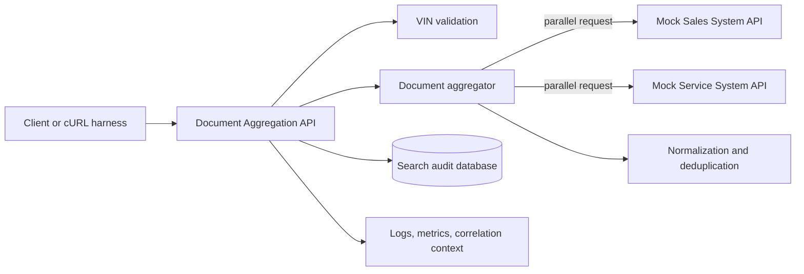
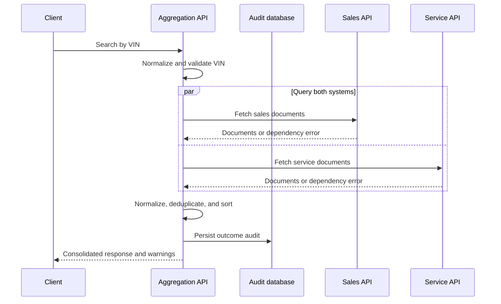

# System Design: Unified Document Viewer

## Status

Implemented and reviewed against the code on July 14, 2026.

## 1. Problem statement

Dealership users currently need to consult separate Sales and Service systems to locate documents related to a vehicle. The Unified Document Viewer provides one VIN-based search that aggregates document metadata from both systems into a single source-attributed response.

## 2. Scope

### In scope

- REST endpoint for VIN-based document search.
- Parallel calls to mocked Sales and Service APIs.
- Normalization, source attribution, deduplication, and deterministic ordering.
- Partial results when one downstream dependency is unavailable.
- Persistent search audit records.
- Structured logging, metrics design, and trace/correlation context.
- API contract and automated tests.
- Swagger UI and cURL examples as the mocked client-side layer.

### Out of scope

- Custom production frontend. Swagger UI is included as the client stub permitted by the assessment.
- Authentication and authorization implementation.
- Storing or serving document binary content.
- Production cloud infrastructure.
- Event-driven synchronization between dealership systems.

## 3. Initial assumptions

The following assumptions are accepted for the implementation:

1. The API returns document metadata and retrievable document references, not document binary content.
2. A search is considered partially successful when one downstream system succeeds and the other fails or times out.
3. A total downstream failure produces a service error rather than a successful empty list.
4. Search audit records satisfy the assessment's persistent-database requirement without copying downstream document data.
5. Authentication is outside the implementation scope, but the design assumes an authenticated dealership user in production.
6. VIN input is normalized to uppercase and validated at the API boundary.
7. Downstream calls have separate deadlines so a slow system cannot consume the entire request budget.

## 4. Implemented architecture

## 5. Component responsibilities

| Component | Responsibility |
|---|---|
| Document Aggregation API | Validate requests, establish correlation context, coordinate aggregation, persist audit outcome, and return the public contract. |
| Sales client | Call the Sales mock API, enforce its timeout, and translate dependency-specific failures. |
| Service client | Call the Service mock API, enforce its timeout, and translate dependency-specific failures. |
| Aggregator | Start both dependency calls concurrently and combine successful outcomes according to the partial-failure policy. |
| Normalizer | Convert dependency-specific document formats into the public document model. |
| Deduplicator/sorter | Apply the documented identity rule and stable ordering. |
| Search audit writer | Insert a minimal record of the search outcome without document content. |
| Mock APIs | Provide deterministic success, empty, slow, malformed, and failure responses for demonstrations and tests. |

## 6. Request data flow

## 7. Public API contract

The public contract is defined in `docs/api/openapi.yaml`:

- `GET /api/v1/vehicles/{vin}/documents`.
- `200 COMPLETE` when both dependencies respond validly, including when both return no documents.
- `200 PARTIAL` with source warnings when exactly one dependency is unusable.
- `400` RFC 9457-style problem for malformed VINs.
- `503` RFC 9457-style problem when neither dependency produces usable data.
- `500` when the required audit record cannot be persisted or another unexpected internal error occurs.
- Correlation ID in both the response body and `X-Correlation-ID` header.

The mocked dependency contracts are defined separately in `docs/api/sales-system.openapi.yaml` and `docs/api/service-system.openapi.yaml` to make the normalization boundary visible.

## 8. Persistence strategy

Persist one search audit record with:

- UUID primary key and correlation ID,
- HMAC-SHA256 fingerprint of the normalized VIN,
- request and completion timestamps,
- overall outcome,
- Sales and Service outcomes,
- result count, and
- duration in milliseconds.

The raw VIN, document metadata, document URLs, and downstream error bodies are not stored. The write is synchronous and required before returning the API response.

## 9. Reliability strategy

- Concurrent downstream calls to minimize combined latency.
- Independent, configurable two-second dependency timeouts.
- Partial results for a single dependency failure.
- Bounded error responses for total failure.
- No automatic retries in this implementation; production retries require an explicit latency and load-shedding policy.
- No circuit-breaker implementation unless time permits; document the production strategy instead.

## 10. Observability strategy

### Logs

- Structured logs with correlation ID.
- Request completion outcome, latency, result count, and per-dependency outcome.
- No document contents or unnecessary customer information.

### Metrics

- Request count and latency by overall outcome.
- Per-dependency request latency and outcome counts.
- Partial-response and total-failure counts.
- Returned document count distribution.

### Tracing

- The submission implements propagated correlation IDs rather than distributed tracing.
- A production implementation would add OpenTelemetry request, Sales, Service, and audit spans and propagate standard trace context.

## 11. Security and privacy considerations

- Validate and constrain all external input.
- Treat downstream document references as sensitive metadata.
- Avoid exposing raw dependency errors.
- Avoid logging document data.
- Apply authentication, dealership-level authorization, encryption, and retention controls in production.

## 12. Scalability and performance

- Keep the API stateless so instances can scale horizontally.
- Use connection pooling for the database and downstream HTTP calls.
- Bound concurrency, request sizes, and timeouts.
- Consider short-lived metadata caching only after measuring downstream load and freshness requirements.
- Add pagination or response limits if document counts can become large.

## 13. Technology choices

| Technology | Selected version | Justification |
|---|---:|---|
| Kotlin | 2.4.0 | Current stable Kotlin release and the owner's selected JVM language. Its null-safety, data classes, and coroutine support fit contract modelling and parallel I/O. |
| Spring Boot | 4.1.0 | Current stable Spring Boot release, providing REST, validation, configuration, health, metrics, testing, and dependency management. |
| Java | 25 LTS | Current long-term-support Java baseline. It is supported by Spring Boot 4.1 while avoiding the shorter lifecycle of a non-LTS feature release. |
| Gradle | 9.5.0 | Current stable Gradle release supported by Spring Boot 4.1, used through a checked-in wrapper for reproducibility. |
| PostgreSQL | 18.4 | Current stable PostgreSQL major and minor release for persistent search auditing. |
| Flyway | Spring Boot managed | Versioned, reviewable database schema migrations without an independently forced version. |
| springdoc-openapi | 3.0.3 | Current stable Spring Boot 4-compatible line, supplying the OpenAPI contract and Swagger UI client stub. |
| Testcontainers | 2.0.5 BOM | Real PostgreSQL integration tests without requiring a shared developer database. The BOM is explicit because Spring Boot 4.1 did not supply these test-module versions in the verified build. |
| Docker Compose | Host installation | Reproducible local database and mock-service demonstration environment where useful. |

“Latest” means the latest stable, mutually compatible release verified on July 13, 2026. Milestones, release candidates, snapshots, and experimental APIs are excluded.

## 14. GenAI use in the design phase

AI assisted with extracting the assessment, comparing the four scenarios, identifying Scenario D's reliability and persistence ambiguities, proposing a risk-adjusted three-day scope, implementing the accepted design, and creating continuity documentation. The owner retained responsibility for accepting the scenario, stack, scope, and tradeoffs and for the submitted result.

Detailed prompts, verification, corrections, and ownership notes are maintained in `docs/AI_COLLABORATION.md`.

## 15. Normalization, identity, and ordering

Sales and Service responses are translated into one public document model. Identity is `(sourceSystem, sourceDocumentId)`, so duplicates are removed only within one source. Cross-system records are preserved. When the same source repeats an identity, the newest timestamp wins and the lexicographically smallest title breaks a tie.

The combined result is sorted by creation time descending, then source system and source document ID ascending. This makes the API deterministic regardless of parallel completion order.

## 16. Implementation structure

- `api`: public controller, RFC 9457 error translation, response models, and correlation filter.
- `service`: concurrent orchestration, complete/partial/failed policy, metrics, normalization, deduplication, and ordering.
- `client`: one adapter per source-specific HTTP contract and bounded failure classification.
- `audit`: the Spring Data JDBC aggregate, explicit insert writer, HMAC fingerprinting, and required persistence boundary.
- `domain`: VIN and source-neutral document models plus the source-client port.

The mock services deliberately keep independent DTOs and fixture behavior. This makes schema translation visible rather than creating an unrealistic shared model between separately owned systems. PostgreSQL is orchestrated through `compose.yml`; Testcontainers starts an isolated PostgreSQL 18.4 database for the persistence integration test.

## 17. Production evolution

The assessment implementation deliberately stops before production infrastructure. The next production steps would be:

1. Add identity, dealership-scoped authorization, secrets management, and audit retention controls.
2. Add OpenTelemetry traces and service-level objectives around latency, partial responses, and dependency health.
3. Define a retry budget, jitter, circuit breaking, and bulkheads using measured dependency behavior.
4. Decouple required audit delivery through a durable event pipeline if database availability should not affect searches.
5. Add response limits or pagination and consider short-lived metadata caching only after measuring cardinality and freshness needs.
