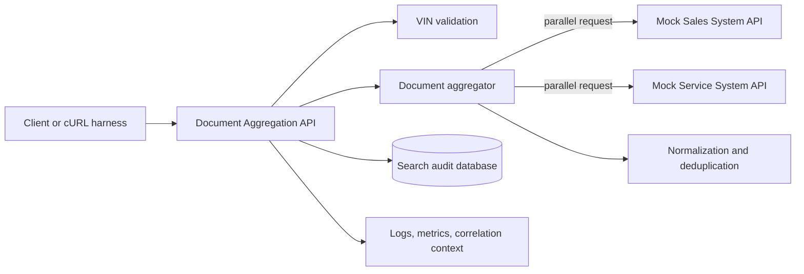
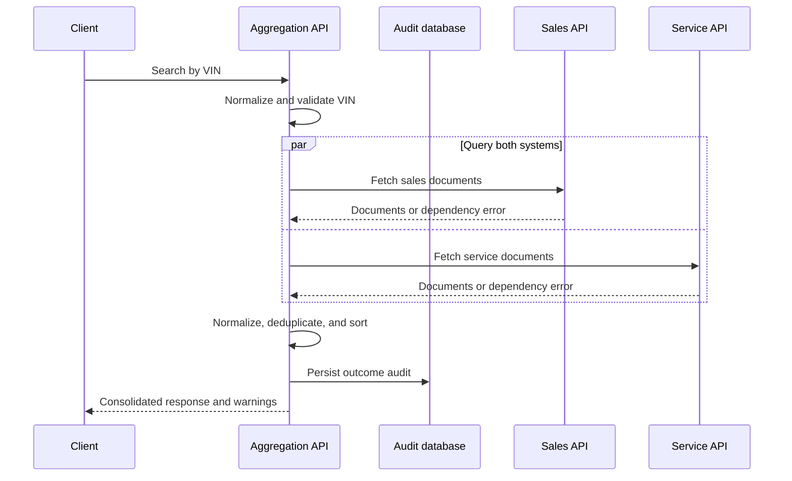

# System Design: Unified Document Viewer

## Status

Draft. The scenario and service-layer choice are accepted; the implementation stack and detailed API schema remain to be decided.

## 1. Problem statement

Dealership users currently need to consult separate Sales and Service systems to locate documents related to a vehicle. The Unified Document Viewer provides one VIN-based search that aggregates document metadata from both systems into a single source-attributed response.

## 2. Scope

### In scope

- REST endpoint for VIN-based document search.
- Parallel calls to mocked Sales and Service APIs.
- Normalization, source attribution, deduplication, and deterministic ordering.
- Partial results when one downstream dependency is unavailable.
- Persistent search audit records.
- Structured logging, metrics design, and trace/correlation context.
- API contract and automated tests.

### Out of scope

- Production frontend.
- Authentication and authorization implementation.
- Storing or serving document binary content.
- Production cloud infrastructure.
- Event-driven synchronization between dealership systems.

## 3. Initial assumptions

These assumptions must be validated or explicitly retained before implementation:

1. The API returns document metadata and retrievable document references, not document binary content.
2. A search is considered partially successful when one downstream system succeeds and the other fails or times out.
3. A total downstream failure produces a service error rather than a successful empty list.
4. Search audit records satisfy the assessment's persistent-database requirement without copying downstream document data.
5. Authentication is outside the implementation scope, but the design assumes an authenticated dealership user in production.
6. VIN input is normalized to uppercase and validated at the API boundary.
7. Downstream calls have separate deadlines so a slow system cannot consume the entire request budget.

## 4. Proposed architecture

## 5. Component responsibilities

| Component | Responsibility |
|---|---|
| Document Aggregation API | Validate requests, establish correlation context, coordinate aggregation, persist audit outcome, and return the public contract. |
| Sales client | Call the Sales mock API, enforce its timeout, and translate dependency-specific failures. |
| Service client | Call the Service mock API, enforce its timeout, and translate dependency-specific failures. |
| Aggregator | Start both dependency calls concurrently and combine successful outcomes according to the partial-failure policy. |
| Normalizer | Convert dependency-specific document formats into the public document model. |
| Deduplicator/sorter | Apply the documented identity rule and stable ordering. |
| Search audit repository | Persist a minimal record of the search outcome without document content. |
| Mock APIs | Provide deterministic success, empty, slow, malformed, and failure responses for demonstrations and tests. |

## 6. Request data flow

## 7. Public API contract

To be finalized before scaffolding. The contract must define:

- VIN path or query parameter and validation errors.
- Normalized document fields.
- Source-system enum.
- Partial-result warning representation.
- Empty, partial, total-failure, and unexpected-error semantics.
- Correlation ID exposure.

## 8. Persistence strategy

Persist minimal search audit data such as normalized VIN or a privacy-preserving derivative, request timestamp, correlation ID, dependency outcomes, result count, overall outcome, and latency. Do not persist document bodies or URLs without a demonstrated requirement.

The final schema and retention assumptions remain to be recorded.

## 9. Reliability strategy

- Concurrent downstream calls to minimize combined latency.
- Independent, configurable dependency timeouts.
- Partial results for a single dependency failure.
- Bounded error responses for total failure.
- No automatic retries until retry safety, latency budget, and mock behavior are explicitly decided.
- No circuit-breaker implementation unless time permits; document the production strategy instead.

## 10. Observability strategy

### Logs

- Structured logs with correlation ID.
- Request completion outcome, latency, result count, and per-dependency outcome.
- No document contents or unnecessary customer information.

### Metrics

- Request count and latency by overall outcome.
- Per-dependency request latency, timeout count, and error count.
- Partial-response and total-failure counts.
- Returned document count distribution.

### Tracing

- One request span with child spans for the Sales and Service calls and audit persistence.
- Propagate standard trace context in a production design; use correlation IDs as the minimum implementation.

## 11. Security and privacy considerations

- Validate and constrain all external input.
- Treat downstream document references as sensitive metadata.
- Avoid exposing raw dependency errors.
- Avoid logging document data.
- Apply authentication, dealership-level authorization, encryption, and retention controls in production.

## 12. Scalability and performance

- Keep the API stateless so instances can scale horizontally.
- Use connection pooling for the database and downstream HTTP calls.
- Bound concurrency, request sizes, and timeouts.
- Consider short-lived metadata caching only after measuring downstream load and freshness requirements.
- Add pagination or response limits if document counts can become large.

## 13. Technology choices

Decision pending. Selection criteria:

- the owner's interview fluency,
- fast local setup,
- clear concurrency primitives,
- mature HTTP testing,
- database migration support,
- OpenAPI support, and
- straightforward structured telemetry.

## 14. GenAI use in the design phase

AI assisted with extracting the assessment, comparing the four scenarios, identifying Scenario D's reliability and persistence ambiguities, proposing a risk-adjusted three-day scope, and creating continuity documentation. The owner must review and accept the assumptions and technology decision before implementation.

Detailed prompts, verification, corrections, and ownership notes are maintained in `docs/AI_COLLABORATION.md`.

## 15. Open decisions

- Implementation language and framework.
- Exact public and downstream schemas.
- Search audit schema and VIN privacy treatment.
- Deduplication identity rule.
- Result ordering rule.
- Timeout values and overall request budget.
- Whether retries will be implemented or documented only.

